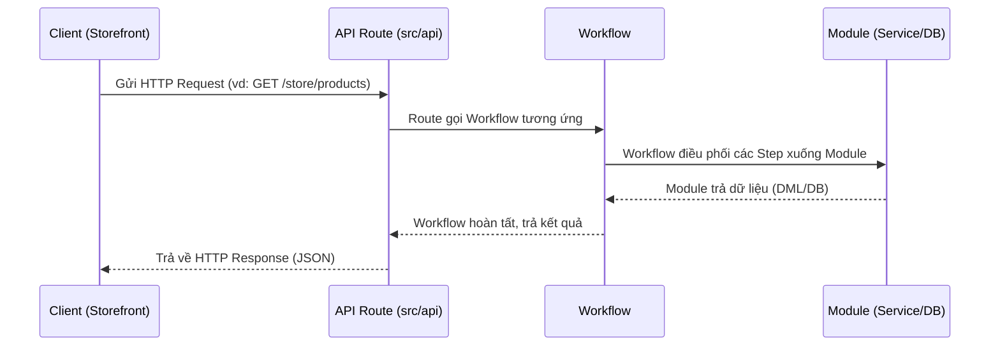

# Phase 1: Cài đặt & Kiến trúc Medusa v2

## 1. Trạng thái cài đặt
- **Khởi tạo:** Chạy thành công thông qua `create-medusa-app` với pnpm (đã fix lỗi bảo mật của pnpm bằng `approve-builds`).
- **Hạ tầng (Docker):** 
  - PostgreSQL 15 chạy ở port `5433` (container: `database`)
  - Redis 7 chạy ở port `6380` (container: `redis`)
- **Khởi động:**
  - Database được tạo bằng: `npx medusa db:migrate`
  - Admin tạo bằng: `npx medusa user -e admin@medusa-test.com`
  - Backend API & Admin Dashboard chạy ở: `http://localhost:9000`
  - Next.js Storefront chạy ở: `http://localhost:8000` (yêu cầu cấu hình Publishable Key vào `.env.local`).

## 2. Các khái niệm cốt lõi (Kiến trúc)

### 2.1. Module & Isolation (Sự cô lập)
Trong Medusa v2, các logic nghiệp vụ được chia thành các **Modules** độc lập (ví dụ: Auth Module, Customer Module, Cart Module). 
- **Độc lập dữ liệu:** Các module không share trực tiếp bảng trong Database thông qua Foreign Key như TypeORM truyền thống.
- Điều này cho phép Medusa dễ dàng thay thế, mở rộng hoặc triển khai các module thành các microservices riêng lẻ nếu hệ thống scale lớn.

### 2.2. Module Link
Vì các module hoàn toàn cô lập, Medusa v2 sử dụng khái niệm **Module Link** để liên kết dữ liệu giữa 2 module khác nhau. 
- Thay vì dùng Foreign Key ở cấp độ Database, Module Link tạo ra bảng trung gian kết nối các bản ghi của 2 module thông qua logic ứng dụng.
- Ví dụ: `AuthIdentity` (của Auth Module) liên kết 1-1 với `Customer` (của Customer Module) thông qua Module Link.

## 3. Sơ đồ Request Flow (Đơn giản hóa)

## 4. Bài học rút ra (Gotchas)
- Luôn phải detect đúng package manager (ở đây là pnpm workspace).
- Không tự ý thêm thư viện chung ở root, thư viện của app nào phải cài vào app đó (`cd apps/backend && pnpm add...`).
- Backend phải chạy migration để DB có bảng, Storefront bắt buộc phải có `NEXT_PUBLIC_MEDUSA_PUBLISHABLE_KEY` mới có thể gọi API Backend thành công.
