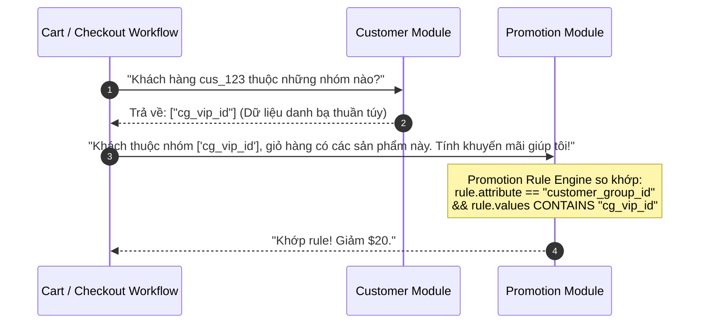
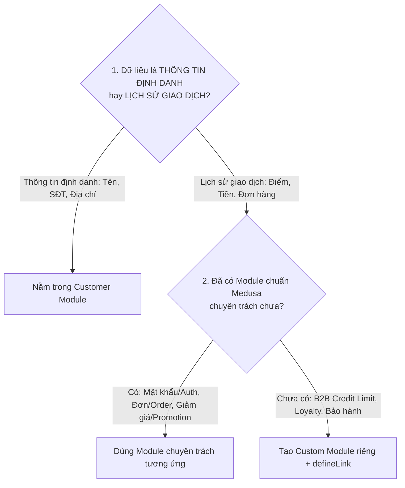
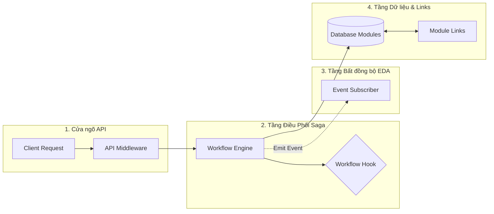

# Medusa v2 Architecture Q&A — Bộ Câu Hỏi Phản Biện Chuyên Sâu

> **Tài liệu tổng hợp các câu hỏi kiến trúc cốt lõi thường gặp khi làm việc với Medusa v2 (Customer Module, Auth Module, Database Constraints, Transactions & Saga Pattern).**  
> *Dành cho việc tự ôn luyện, thảo luận kỹ thuật và phản biện với đồng nghiệp / Tech Lead.*

---

## MỤC LỤC

1. [Q1: Tại sao mỗi khách hàng chỉ được có TỐI ĐA 1 Default Shipping và 1 Default Billing?](#q1-tại-sao-mỗi-khách-hàng-chỉ-được-có-tối-đa-1-default-shipping-và-1-default-billing)
2. [Q2: Partial Unique Index là gì? Tại sao Medusa v2 lại sử dụng nó trên bảng `customer_address`?](#q2-partial-unique-index-là-gì-tại-sao-medusa-v2-lại-sử-dụng-nó-trên-bảng-customer_address)
3. [Q3: Tại sao trước bảo "Medusa không dùng Transaction", nhưng chỗ này lại bảo "bọc trong Transaction"?](#q3-tại-sao-trước-bảo-medusa-không-dùng-transaction-nhưng-chỗ-này-lại-bảo-bọc-trong-transaction)
4. [Q4: Tại sao trong bảng `auth_identity`, `customer_id` chỉ được lưu trong `app_metadata` (JSONB) mà không tạo cột riêng hay Foreign Key?](#q4-tại-sao-trong-bảng-auth_identity-customer_id-chỉ-được-lưu-trong-app_metadata-jsonb-mà-không-tạo-cột-riêng-hay-foreign-key)
5. [Q5: Tóm tắt kịch bản 45 giây giải thích cho đồng nghiệp / Tech Lead](#q5-tóm-tắt-kịch-bản-45-giây-giải-thích-cho-đồng-nghiệp--tech-lead)
6. [Q6: Tại sao tài liệu Customer Module không liệt kê TẤT CẢ các bảng có chứa `customer_id` (như `cart`, `order`, `auth_identity`...)?](#q6-tại-sao-tài-liệu-customer-module-không-liệt-kê-tất-cả-các-bảng-có-chứa-customer_id-như-cart-order-auth_identity)
7. [Q7: Tại sao việc xác định rõ Bounded Context là nhiệm vụ sống còn để làm chủ Customer Module?](#q7-tại-sao-việc-xác-định-rõ-bounded-context-là-nhiệm-vụ-sống-còn-để-làm-chủ-customer-module)
8. [Q8: Bảng `customer` và bảng `user` khác nhau như thế nào? Tại sao chúng chả liên quan gì đến nhau?](#q8-bảng-customer-và-bảng-user-khác-nhau-như-thế-nào-tại-sao-chúng-chả-liên-quan-gì-đến-nhau)
9. [Q9: Các điểm cắm (Hook Points) trong Workflow của Customer Module là gì? Cách viết code Custom Logic kèm cơ chế bù trừ Saga (Compensation)?](#q9-các-điểm-cắm-hook-points-trong-workflow-của-customer-module-là-gì-cách-viết-code-custom-logic-kèm-cơ-chế-bù-trừ-saga-compensation)
10. [Q10: Người dùng có thể spam hàng nghìn địa chỉ (`customer_address`) làm sập hệ thống không? Cơ chế phòng thủ 3 lớp trong Enterprise?](#q10-người-dùng-có-thể-spam-hàng-nghìn-địa-chỉ-customer_address-làm-sập-hệ-thống-không-cơ-chế-phòng-thủ-3-lớp-trong-enterprise)
11. [Q11: Customer Module có thực sự độc lập với Promotion Module không khi Docs ghi "Customer Group dùng để giảm giá với Promotion Module"?](#q11-customer-module-có-thực-sự-độc-lập-với-promotion-module-không-khi-docs-ghi-customer-group-dùng-để-giảm-giá-với-promotion-module)
12. [Q12: Phân định Bounded Context trong Medusa v2: Những task nào THỰC SỰ cần custom trong Customer Module và những task nào DỄ NHẦM LẪN nhất?](#q12-phân-định-bounded-context-trong-medusa-v2-những-task-nào-thực-sự-cần-custom-trong-customer-module-và-những-task-nào-dễ-nhầm-lẫn-nhất)
13. [Q13: Core-flows của Customer Module đã đủ phục vụ CRUD chưa? Tại sao thao tác Read (R) lại KHÔNG dùng Workflow? Khi nào đủ và khi nào phải custom?](#q13-core-flows-của-customer-module-đã-đủ-phục-vụ-crud-chưa-tại-sao-thao-tác-read-r-lại-không-dùng-workflow-khi-nào-đủ-và-khi-nào-phải-custom)
14. [Q14: Cơ chế Workflow Hooks trong thực tế: Điểm cắm `customersCreated` nằm ở file nào trong Core, viết ở đâu trong dự án và cơ chế Autoloading vận hành ra sao?](#q14-cơ-chế-workflow-hooks-trong-thực-tế-điểm-cắm-customerscreated-nằm-ở-file-nào-trong-core-viết-ở-đâu-trong-dự-án-và-cơ-chế-autoloading-vận-hành-ra-sao)
15. [Q15: Tại sao bảo "Điểm thưởng thuộc Loyalty Module" nhưng lại thấy xử lý trong hook của Customer Workflow? Có bị vi phạm Bounded Context không?](#q15-tại-sao-bảo-điểm-thưởng-thuộc-loyalty-module-nhưng-lại-thấy-xử-lý-trong-hook-của-customer-workflow-có-bị-vi-phạm-bounded-context-không)
16. [Q16: Có phải luôn có 2 cách để custom: dùng Workflow Hook (Extension Point) hoặc dùng Event-Driven (Subscriber)? Toàn cảnh 5 cấp độ custom trong Medusa v2?](#q16-có-phải-luôn-có-2-cách-để-custom-dùng-workflow-hook-extension-point-hoặc-dùng-event-driven-subscriber-toàn-cảnh-5-cấp-độ-custom-trong-medusa-v2)
17. [Q17: Dưới góc nhìn Java/Spring Boot: Tại sao Medusa v2 dùng `container.resolve(Modules.CUSTOMER)` (Service Locator) thay vì `@Autowired`? Sự chuyển dịch sang Functional Programming?](#q17-dưới-góc-nhìn-javaspring-boot-tại-sao-medusa-v2-dùng-containerresolvemodulescustomer-service-locator-thay-vì-autowired-sự-chuyển-dịch-sang-functional-programming)

---

### Q1: Tại sao mỗi khách hàng chỉ được có TỐI ĐA 1 Default Shipping và 1 Default Billing?

#### 1. Bản chất của từ "Default" (Mặc định) trong UX & Hệ thống
- **"Mặc định"** là giá trị được hệ thống tự động chọn sẵn khi người dùng chưa đưa ra lựa chọn cụ thể.
- Nếu một khách hàng có 5 địa chỉ trong sổ địa chỉ, nhưng lại có **2 địa chỉ cùng mang cờ `is_default_shipping = true`**:
  - Khi người dùng bấm nút **"Mua ngay" (1-Click Checkout)** hoặc dùng Apple Pay / Google Pay, hệ thống sẽ giao hàng đến đâu? Nhà riêng hay Công ty?
  - Hệ thống rơi vào trạng thái **mơ hồ (Ambiguity)**. Nếu code tự chọn ngẫu nhiên 1 trong 2, đơn hàng sẽ bị giao nhầm địa chỉ mà khách hàng không hề hay biết $\rightarrow$ Khiếu nại, hủy đơn, tốn chi phí hoàn hàng.

#### 2. Tự động hóa tính toán trước giỏ hàng (Cart Estimation)
Khi khách đăng nhập vào Storefront:
- Hệ thống cần **tính trước chi phí vận chuyển** (Shipping Rate) và **thuế** (VAT / Sales Tax theo khu vực) ngay tại trang giỏ hàng trước khi khách bấm sang trang Thanh toán.
- Backend tự động lấy `default_shipping_address` để truyền vào Tax Provider và Fulfillment Provider.
- Điền sẵn vào form Checkout để khách hàng không phải gõ lại 5-6 ô thông tin $\rightarrow$ Tối ưu trải nghiệm mua sắm và tỷ lệ chuyển đổi (Conversion Rate).
$\rightarrow$ **Bắt buộc chỉ được có duy nhất 1 địa chỉ đại diện.**

#### 3. Tại sao lại tách riêng Default Shipping và Default Billing?
Trong thương mại điện tử, hai mục đích này thường xuyên khác nhau:
- **Default Shipping (Giao hàng):** Nơi shipper mang kiện hàng vật lý tới (Nhà riêng, văn phòng, nhà người thân).
- **Default Billing (Thanh toán / Hóa đơn):** 
  - Địa chỉ đăng ký trên thẻ tín dụng ngân hàng (để vượt qua bước kiểm tra gian lận thẻ **AVS - Address Verification Service** của Visa/Mastercard).
  - Hoặc địa chỉ trụ sở công ty dùng để **xuất hóa đơn đỏ (VAT Invoice)**.
- Do đó, Medusa tách làm 2 cờ độc lập. Nhưng cho mỗi mục đích, **chỉ có tối đa 1 lựa chọn mặc định**.

#### 4. Tại sao là "TỐI ĐA 1" chứ không phải "BẮT BUỘC 1"?
- Khách mới tạo tài khoản, chưa có địa chỉ nào $\rightarrow$ Có **0** địa chỉ mặc định (Hợp lệ).
- Khách có 3 địa chỉ nhưng chủ động bỏ chọn hết cờ mặc định (muốn mỗi lần mua đều tự tay chọn) $\rightarrow$ Có **0** địa chỉ mặc định (Hợp lệ).
- Tuyệt đối **không được phép có $\ge 2$ địa chỉ cùng là mặc định**.

---

### Q2: Partial Unique Index là gì? Tại sao Medusa v2 lại sử dụng nó trên bảng `customer_address`?

#### 1. Khái niệm cốt lõi
- **Unique Index thông thường:** Quét qua **toàn bộ các dòng** trong bảng. Mọi dòng dữ liệu đều bắt buộc phải có giá trị khác nhau.
- **Partial Unique Index (Chỉ mục duy nhất có điều kiện):** Là chỉ mục **chỉ áp dụng tính duy nhất (UNIQUE) trên một tập con (subset) của bảng**, được xác định thông qua mệnh đề **`WHERE`**.
- Những dòng dữ liệu **không thỏa mãn** điều kiện `WHERE` sẽ hoàn toàn bị Index bỏ qua (không cần phải duy nhất và không tốn bộ nhớ trong cây B-Tree của Index).

#### 2. Ví dụ trực quan: Bảng `customer_address` trong Medusa v2

Khách hàng `cus_123` có 3 địa chỉ:
- Địa chỉ A: Nhà riêng $\rightarrow$ `is_default_shipping = false`
- Địa chỉ B: Quê quán $\rightarrow$ `is_default_shipping = false`
- Địa chỉ C: Công ty $\rightarrow$ `is_default_shipping = true`

##### ❌ Nếu dùng Unique Index thông thường:
```sql
CREATE UNIQUE INDEX idx_fail ON customer_address (customer_id, is_default_shipping);
```
- Dòng A (`cus_123`, `false`) $\rightarrow$ OK.
- Dòng B (`cus_123`, `false`) $\rightarrow$ **LỖI DUPLICATE KEY NGAY LẬP TỨC!**
- Vì DB thấy đã có cặp (`cus_123`, `false`) rồi. Nghĩa là khách hàng **không thể lưu nhiều hơn 1 địa chỉ phụ**. Điều này sai hoàn toàn về nghiệp vụ!

##### ✅ Giải pháp chuẩn mực: Partial Unique Index (Có mệnh đề `WHERE`)
Medusa v2 tạo index trong PostgreSQL như sau:
```sql
CREATE UNIQUE INDEX "IDX_customer_address_unique_customer_shipping" 
ON customer_address (customer_id) 
WHERE (is_default_shipping = true);

CREATE UNIQUE INDEX "IDX_customer_address_unique_customer_billing" 
ON customer_address (customer_id) 
WHERE (is_default_billing = true);
```

**Cách Database vận hành:**
- Khi thêm Địa chỉ A và B (`is_default_shipping = false`): Không thỏa mãn `WHERE` $\rightarrow$ Database bỏ qua, lưu 100 địa chỉ `false` cũng được.
- Khi thêm Địa chỉ C (`is_default_shipping = true`): Thỏa mãn `WHERE` $\rightarrow$ DB đưa `cus_123` vào Index.
- Nếu cố tình thêm Địa chỉ D cũng có `is_default_shipping = true`: DB tra vào Index thấy `cus_123` đã tồn tại $\rightarrow$ **Chặn đứng ngay lập tức với lỗi `unique_violation`!**

#### 3. Hai lợi ích vượt trội:
1. **Chặn đứng Race Condition ở tầng DB:** Nếu người dùng gửi 2 request cập nhật địa chỉ mặc định song song cùng 1 lúc, dù code ứng dụng có bị lọt (race condition) thì DB vẫn là chốt chặn cuối cùng bảo vệ toàn vẹn dữ liệu.
2. **Siêu tiết kiệm RAM & Disk:** Index chỉ lưu những bản ghi có giá trị `true` (thường chiếm $< 5\%$ tổng số dòng) $\rightarrow$ Cây Index siêu nhẹ, tốc độ ghi và đọc cực nhanh.

---

### Q3: Tại sao trước bảo "Medusa không dùng Transaction", nhưng chỗ này lại bảo "bọc trong Transaction"?

Đây là sự khác biệt kinh điển giữa **Giao dịch phân tán (Distributed Transaction)** và **Giao dịch cục bộ (Local Transaction)**:

| Tiêu chí | Macro: Distributed Transaction (Toàn bộ Workflow) | Micro: Local Database Transaction (Nội bộ 1 Module) |
| :--- | :--- | :--- |
| **Phạm vi** | Xuyên suốt nhiều Module độc lập (Cart + Customer + Order + Payment). | Chỉ nằm trong **1 Module duy nhất** tương tác với **1 Database PostgreSQL**. |
| **Medusa xử lý thế nào?** | **KHÔNG dùng DB Transaction!** Medusa sử dụng **Saga Pattern** với các bước bù trừ (Compensation Steps). | **CÓ DÙNG DB Transaction thông thường (`BEGIN ... COMMIT / ROLLBACK`)!** |
| **Tương đương bên Java/Spring** | Giống như microservices gọi qua REST/Kafka, không thể dùng `@Transactional` chung. | Giống hệt một method có `@Transactional` thao tác trên `EntityManager` / `JpaRepository`. |

#### 1. Cấp độ Vĩ mô (Tại sao Workflow KHÔNG dùng DB Transaction?):
- Quy trình Checkout tạo Order đi qua 4 module: Cart $\rightarrow$ Customer $\rightarrow$ Payment $\rightarrow$ Order.
- Nếu mở 1 SQL Transaction từ đầu đến cuối:
  - Giữ kết nối DB quá lâu (trong lúc chờ cổng thanh toán VNPAY/Stripe phản hồi) $\rightarrow$ Cạn kiệt Connection Pool, sập DB.
  - Vi phạm tính độc lập: Nếu sau này tách module ra thành các Microservice riêng, Two-Phase Commit (2PC) rất cồng kềnh và dễ gây treo hệ thống.
  - $\rightarrow$ **Giải pháp: Dùng Saga Pattern (Step nào lỗi thì chạy Step bồi hoàn để hoàn tác).**

#### 2. Cấp độ Vi mô (Tại sao nội bộ Step CẦN Transaction?):
- Trong Customer Module, thao tác đổi địa chỉ mặc định gồm 2 câu SQL liên tiếp:
  1. `UPDATE customer_address SET is_default_shipping = false WHERE customer_id = 'cus_123'`
  2. `INSERT INTO customer_address (...) VALUES ('cus_123', true)`
- Cả 2 câu này nằm trong cùng 1 Database! Nếu câu 1 thành công mà câu 2 bị lỗi crash mạng:
  - Khách hàng bị mất luôn địa chỉ mặc định cũ mà không có địa chỉ mới nào thay thế.
- $\rightarrow$ **Giải pháp: Phải bọc trong 1 Local Transaction của MikroORM:**
```typescript
await this.manager_.transaction(async (transactionManager) => {
  // 1. Gỡ default cũ
  await transactionManager.nativeUpdate(CustomerAddress, 
    { customer_id: customerId, is_default_shipping: true }, 
    { is_default_shipping: false }
  )
  // 2. Tạo địa chỉ mới làm default
  await transactionManager.persistAndFlush(newAddress)
})
```

---

### Q4: Tại sao trong bảng `auth_identity`, `customer_id` chỉ được lưu trong `app_metadata` (JSONB) mà không tạo cột riêng hay Foreign Key?

Bảng `auth_identity` trong database thực tế của Medusa v2:
```text
Cột: id | app_metadata (jsonb) | created_at | updated_at | deleted_at
```
Dữ liệu thực tế:
```json
{
  "id": "authid_01M1ZK8VMR0PRY7TCVF6PCX416",
  "app_metadata": {
    "user_id": "user_01M1ZK8VHX8T9KSQW5378TC5SV",
    "customer_id": "cus_01M20CMM1TGV172ZD66TDC0W6N"
  }
}
```

Có 4 lý do kiến trúc cốt lõi:

#### 1. Nguyên lý Bounded Context trong Domain-Driven Design (DDD)
- **Auth Module** và **Customer Module** là 2 Bounded Context hoàn toàn độc lập:
  - **Auth Module:** Chỉ lo Xác thực (Authentication - lưu mật khẩu băm, Google OAuth, cấp JWT token). Nó hoàn toàn "mù" về thương mại điện tử, không biết và không quan tâm người đăng nhập mua gì, tên gì.
  - Nếu tạo cột `customer_id` có Foreign Key trỏ sang bảng `customer` $\rightarrow$ Auth Module bị **phụ thuộc cứng (Tight Coupling / Domain Contamination)** vào Customer Module, không thể tái sử dụng độc lập được.

#### 2. Vấn đề Đa chủ thể (Polymorphic Actors)
Trong một nền tảng thương mại điện tử, ai là người cần đăng nhập?
- 🛒 **Customer** (Khách mua hàng).
- 👔 **User** (Admin / nhân viên quản trị Dashboard).
- 🏪 **Vendor / Seller** (Người bán hàng trên sàn Marketplace).
- 🚚 **Driver** (Tài xế giao hàng).
- 🏢 **B2B Member** (Khách hàng doanh nghiệp).

Nếu tạo cột cứng:
- Bảng `auth_identity` sẽ phải chứa: `customer_id`, `user_id`, `vendor_id`, `driver_id`...
- Trở thành "bãi rác" chứa đầy các cột Nullable. Mỗi lần cài thêm 1 plugin người dùng mới, lại phải sửa schema bảng Auth!
- **Giải pháp:** Lưu vào `app_metadata` (JSONB). Auth Identity chỉ đại diện cho một danh tính xác thực thuần túy.

#### 3. Một tài khoản có thể đóng NHIỀU VAI TRÒ (Dual Role)
Một người hoàn toàn có thể vừa là **Admin** quản trị kho hàng ban ngày (`user_id`), vừa dùng chính tài khoản đó làm **Khách hàng** mua hàng thử nghiệm (`customer_id`).
Lưu trong JSONB cho phép 1 Auth Identity đại diện cho nhiều Actor cùng một lúc mà không phá vỡ quan hệ dữ liệu.

#### 4. Sẵn sàng cho Microservices (Database per Service)
Nếu sau này hệ thống scale lớn và tách Auth Module ra một Database riêng (hoặc thay bằng Keycloak/Auth0):
- Foreign Key **không thể trỏ xuyên database**.
- Dùng `app_metadata` (JSONB) giúp hệ thống phân tán dễ dàng mà không cần đập đi xây lại cấu trúc bảng.

---

### Q5: Tóm tắt kịch bản 45 giây giải thích cho đồng nghiệp / Tech Lead

> *"Để hiểu tại sao `customer_id` chỉ nằm trong `app_metadata` của `auth_identity`, đội mình nên nhìn dưới góc độ **Domain-Driven Design (DDD)** của Medusa v2:*
>
> 1. *Thứ nhất, **Tách biệt Bounded Context:** Module Auth chỉ lo đúng một việc là Xác thực (Authentication - băm password, OAuth, cấp JWT token). Nó hoàn toàn độc lập và không phụ thuộc vào bất kỳ module nghiệp vụ nào.*
> 2. *Thứ hai, **Bài toán Đa chủ thể (Polymorphic Actors):** Hệ thống không chỉ có Customer đăng nhập, mà còn có Admin User, Vendor, Driver. Dùng `app_metadata` (JSONB) giúp bảng Auth không bị biến thành bãi rác chứa các cột Foreign Key Nullable (`user_id`, `vendor_id`...).*
> 3. *Thứ ba, **Sẵn sàng cho Microservices:** Việc tách rời này giúp Auth Module có thể chạy trên một Database độc lập trong tương lai mà không bị ràng buộc bởi Foreign Key.*
> 
> *Việc liên kết giữa Auth Identity và Customer hoàn toàn do **Medusa Workflow** ở tầng trên điều phối, đảm bảo kiến trúc Loose Coupling (kết nối lỏng) và Clean Architecture."*

---

### Q6: Tại sao tài liệu Customer Module không liệt kê TẤT CẢ các bảng có chứa `customer_id` (như `cart`, `order`, `auth_identity`...)?

#### 1. Nguyên lý "Module Ownership" & Bounded Context (DDD)
- Tài liệu này là tài liệu chuyên khảo về **Customer Module** (`@medusajs/customer`).
- Trong kiến trúc **Modular Architecture** của Medusa v2: Mỗi Module là một **Bounded Context độc lập**, nó chỉ sở hữu (own) và chịu trách nhiệm về các bảng dữ liệu nội bộ do nó sinh ra:
  - `Customer Module` sở hữu 4 bảng nội bộ: `customer`, `customer_address`, `customer_group`, `customer_group_customer`.
  - Bảng thứ 5 là `customer_account_holder`: là bảng Stored Link do Link Engine sinh ra để nối Customer Module ↔ Auth Module.
- Các bảng khác có liên quan:
  - `cart`, `cart_address` $\rightarrow$ Thuộc quyền sở hữu của **Cart Module** (`@medusajs/cart`).
  - `order`, `order_address` $\rightarrow$ Thuộc quyền sở hữu của **Order Module** (`@medusajs/order`).
  - `auth_identity` $\rightarrow$ Thuộc quyền sở hữu của **Auth Module** (`@medusajs/auth`).
- **Rủi ro nếu liệt kê lẫn lộn:** Nếu đưa `cart` hay `order` vào schema của Customer Module, lập trình viên sẽ bị nhầm lẫn rằng Customer Module quản lý luôn cả Giỏ hàng và Đơn hàng, vi phạm nghiêm trọng nguyên lý **Separation of Concerns (Phân định trách nhiệm)**.

#### 2. Dữ liệu thực tế từ PostgreSQL: Cột `customer_id` & Khóa ngoại (Foreign Key)
Kết quả truy vấn trực tiếp từ PostgreSQL:
1. **`auth_identity` HOÀN TOÀN KHÔNG CÓ cột `customer_id`!** 
   - Auth Module chỉ lưu metadata trong `app_metadata: jsonb`. Sự liên kết giữa Customer và Auth được lưu ở bảng Stored Link `customer_account_holder`.
2. **`order` và `cart` có cột `customer_id`, nhưng KHÔNG CÓ FOREIGN KEY trỏ sang `customer`!**
   - Trong toàn bộ database, **CHỈ CÓ DUY NHẤT 2 BẢNG NỘI BỘ** có Foreign Key cứng tới bảng `customer`:
     - `customer_address.customer_id` $\rightarrow$ `customer(id)`
     - `customer_group_customer.customer_id` $\rightarrow$ `customer(id)`
   - Cột `order.customer_id` và `cart.customer_id` chỉ là **Soft Reference (Tham chiếu mềm)** kiểu `text`, hoàn toàn không có ràng buộc `REFERENCES customer(id)`.
   - **Tại sao?** Để các module `Order` hay `Cart` có thể dễ dàng tách thành Microservices độc lập hoặc chạy trên database riêng biệt (Database per Service) mà không bị gãy ràng buộc khóa ngoại!

#### 3. Các bảng này nằm ở đâu trong tài liệu Notion?
Các bảng liên module không bị bỏ quên, mà được đặt đúng vị trí kiến trúc của chúng tại **Chương 4: Kiến Trúc Tích Hợp Liên Module**:
- **Mục 4.1 (Bảng Module Links):** Giải thích chi tiết liên kết giữa Customer với Cart, Order, Auth, Payment.
- **Mục 4.2 & 4.4 (Sequence Diagrams):** Mô tả dòng chảy dữ liệu thực tế giữa Storefront và các Module.

---

### Q7: Tại sao việc xác định rõ Bounded Context là nhiệm vụ sống còn để làm chủ Customer Module?

#### 1. Chống lại căn bệnh "Spaghetti Architecture" (Ô nhiễm Domain)
Trong thực tế dự án, khách hàng và ban giám đốc sẽ liên tục yêu cầu các tính năng mở rộng:
- *"Lưu điểm thưởng tích lũy của khách hàng."*
- *"Gửi mã OTP Zalo khi khách đăng ký."*
- *"Hiển thị tổng số tiền khách đã chi tiêu (Total Spend)."*

- ❌ **Nếu KHÔNG nắm vững Bounded Context:**
  Dev sẽ tiện tay thêm các cột `loyalty_points`, `otp_code`, `total_spent` vào bảng `customer`, rồi viết logic trừ điểm, gửi tin nhắn, tính toán đơn hàng thẳng vào trong `CustomerService`.
  $\rightarrow$ **Hậu quả:** Sau 6 tháng, bảng `customer` biến thành một **"God Table" khổng lồ**, code đan xen chằng chịt, việc sửa một hàm khách hàng có thể làm sập luôn luồng thanh toán hoặc tính khuyến mãi!
- ✅ **Khi ĐÃ LÀM CHỦ Bounded Context của Customer Module:**
  Bạn sẽ vạch rõ ngay ranh giới:
  - Customer Module chỉ làm đúng vai trò **Sổ Danh Bạ:** Hồ sơ cá nhân + Sổ địa chỉ + Phân nhóm.
  - **Điểm thưởng tích lũy?** $\rightarrow$ Thuộc về **Loyalty Module** (Tạo module riêng và nối qua Module Link).
  - **Mã OTP?** $\rightarrow$ Thuộc về **Auth & Notification Module** (Xác thực xong mới gọi sang Customer để cập nhật).
  - **Tổng chi tiêu?** $\rightarrow$ Thuộc về **Order Module** (Query tính toán từ Order, không lưu cứng vào Customer).

#### 2. Quy tắc ranh giới vàng: "Nội bộ chặt chẽ — Bên ngoài kết nối lỏng"

| Tiêu chí | Bên trong Bounded Context (Nội bộ Customer Module) | Bước qua Bounded Context (Giao tiếp với Module khác) |
| :--- | :--- | :--- |
| **Tính nhất quán dữ liệu** | Nhất quán tuyệt đối, tức thời (**Strong Consistency**). | Nhất quán sau (**Eventual Consistency** qua Saga / Workflows). |
| **Ràng buộc Database** | Có **Foreign Key cứng** (`customer_address` $\rightarrow$ `customer`). | **TUYỆT ĐỐI KHÔNG có Foreign Key cứng** (Dùng Soft Reference như `cart.customer_id` hoặc Stored Link Table). |
| **Cơ chế Transaction** | Dùng **Local Database Transaction** thông thường (`BEGIN ... COMMIT`). | Dùng **Saga Pattern (Compensation Steps)**, không dùng DB Transaction toàn cục. |

---

### Q8: Bảng `customer` và bảng `user` khác nhau như thế nào? Tại sao chúng chả liên quan gì đến nhau?

#### 1. Bảng so sánh đối đầu: `customer` vs `user`

| Tiêu chí | `customer` (Khách Mua Hàng) | `user` (Nhân Viên / Quản Trị Viên) |
| :--- | :--- | :--- |
| **Bản chất nghiệp vụ** | Là **Khách hàng / Người mua sắm** (Shopper / Buyer) bên ngoài Storefront. | Là **Nhân viên / Admin / Operator** nội bộ doanh nghiệp. |
| **Bounded Context & Module** | Thuộc **Customer Module** (`@medusajs/customer`). | Thuộc **User Module** (`@medusajs/user`). |
| **Giao diện tương tác** | Website bán lẻ Storefront, Mobile App mua sắm của khách. | Giao diện quản trị nội bộ: **Medusa Admin Dashboard** (`/app`). |
| **API Endpoints** | Gọi vào các route `/store/*` (`/store/customers`, `/store/carts`...). | Gọi vào các route `/admin/*` (`/admin/products`, `/admin/orders`...). |
| **Dữ liệu đi kèm trong DB** | Sổ địa chỉ (`customer_address`), Nhóm giảm giá (`customer_group`), Công ty B2B (`company_name`). | Cài đặt cá nhân dashboard (`user_preference`), Phân quyền (`user_rbac_role`), Lời mời tuyển dụng (`invite`). |
| **Quy mô dữ liệu (Scale)** | Rất lớn: Hàng trăm nghìn đến **hàng chục triệu bản ghi** (High Throughput). | Rất nhỏ: Chỉ vài người, vài chục đến **vài trăm nhân viên**. |
| **Ràng buộc Database** | **Hoàn toàn KHÔNG CÓ Foreign Key nào** nối giữa 2 bảng này trong PostgreSQL. |

#### 2. Tại sao Medusa tách riêng mà không gộp chung vào 1 bảng `users` với cột `role`?

Trong kiến trúc phần mềm cũ, gộp chung thành 1 bảng `users` với cột `role = 'ADMIN' | 'CUSTOMER'` là một **Anti-Pattern** nghiêm trọng vì:
1. **Tránh ô nhiễm Schema (Schema Pollution):** Khách hàng cần `shipping_address`, `loyalty_points`, `company_name`; nhân viên cần `department`, `salary`, `rbac_role`. Gộp chung sẽ tạo ra một bảng đầy các cột `NULL` chéo nhau.
2. **Ngăn chặn leo thang đặc quyền (Privilege Escalation):** Nếu chung bảng, một lỗi logic nhỏ ở API cập nhật thông tin khách hàng (ví dụ: client inject `{ "role": "ADMIN" }`) có thể biến khách hàng thành Admin hệ thống.
3. **Scale độc lập:** Bảng `customer` có hàng triệu bản ghi đọc/ghi liên tục có thể đánh partition/shard riêng mà không ảnh hưởng tới bảng `user` của khối vận hành.

#### 3. Điểm gặp nhau DUY NHẤT: Cả hai đều là Actor của Auth Module
Cả hai đều là con người cần đăng nhập, vì vậy cùng sử dụng chung **Auth Module** (`auth_identity`):
- Admin đăng nhập `/app` $\rightarrow$ Nhận JWT token mang `actor_id = user_id`, quyền `admin`.
- Khách hàng đăng nhập `/store` $\rightarrow$ Nhận JWT token mang `actor_id = customer_id`, quyền `store`.
- Một người thật ngoài đời hoàn toàn có thể vừa là Admin ban ngày (`user_id`), vừa mua hàng ban đêm (`customer_id`) trên cùng một danh tính Auth mà không bị xung đột dữ liệu.

---

### Q9: Các điểm cắm (Hook Points) trong Workflow của Customer Module là gì? Cách viết code Custom Logic kèm cơ chế bù trừ Saga (Compensation)?

#### 1. Danh mục 6 Workflow Hook Points chính thức trong Medusa Core

Trong mã nguồn Medusa Core (`packages/core/core-flows/src/customer`), có 6 điểm cắm hook sẵn sàng:

| Workflow | Tên Hook Point (`createHook`) | Dữ liệu nhận được | Nghiệp vụ thực tế hay dùng |
| :--- | :--- | :--- | :--- |
| **`createCustomersWorkflow`** | `customersCreated` | `{ customers: CustomerDTO[], additional_data }` | Tạo ví điểm thưởng trong `LoyaltyModule`, khởi tạo hạn mức công nợ B2B, tạo hồ sơ trên CRM (HubSpot/Salesforce). |
| **`updateCustomersWorkflow`** | `customersUpdated` | `{ customers: CustomerDTO[], additional_data }` | Đồng bộ thông tin đổi tên/SĐT sang hệ thống ERP nội bộ. |
| **`deleteCustomersWorkflow`** | `customersDeleted` | `{ ids: string[] }` | Đóng băng tài khoản liên kết, khóa ví điện tử. |
| **`createCustomerAddressesWorkflow`** | `addressesCreated` | `{ addresses: CustomerAddressDTO[], additional_data }` | Gọi Google Maps API chuẩn hóa địa chỉ, tính tọa độ GPS (lat/lng) phục vụ giao hàng. |
| **`updateCustomerAddressesWorkflow`** | `addressesUpdated` | `{ addresses: CustomerAddressDTO[], additional_data }` | Cập nhật lại tọa độ giao hàng mới. |
| **`deleteCustomerAddressesWorkflow`** | `addressesDeleted` | `{ ids: string[] }` | Dọn dẹp cache địa chỉ giao hàng. |

#### 2. Mã nguồn mẫu chuẩn Enterprise: Loyalty Wallet Hook có Saga Compensation

Tạo file `src/workflows/hooks/customer-created.ts`:

```typescript
import { createCustomersWorkflow } from "@medusajs/medusa/core-flows"
import { StepResponse } from "@medusajs/framework/workflows-sdk"

// 🎯 Chọc hook vào điểm customersCreated của createCustomersWorkflow
createCustomersWorkflow.hooks.customersCreated(
  // 1. EXECUTION STEP: Chạy đồng bộ trong luồng Saga
  async ({ customers, additional_data }, { container }) => {
    const loyaltyModuleService = container.resolve("loyaltyModuleService")
    const createdWallets = []

    // Lưu ý: customers là MẢNG (Array), cần duyệt for để an toàn cho cả Batch Import
    for (const customer of customers) {
      const wallet = await loyaltyModuleService.createWallet({
        customer_id: customer.id,
        initial_points: 100, // Tặng 100 điểm tân thủ
        referral_code: additional_data?.referral_code, // Nhận dữ liệu truyền thêm từ API
      })
      createdWallets.push(wallet)
    }

    // Trả về kết quả kèm dữ liệu Rollback (tham số thứ 2)
    return new StepResponse(createdWallets, { 
      createdWalletIds: createdWallets.map((w) => w.id) 
    })
  },

  // 2. COMPENSATION STEP: Tự động chạy khi có lỗi ở các bước sau để Hoàn tác dữ liệu
  async (compensationData, { container }) => {
    if (!compensationData?.createdWalletIds?.length) return

    const loyaltyModuleService = container.resolve("loyaltyModuleService")
    // Xóa sạch các ví vừa tạo để không để lại dữ liệu rác mồ côi
    await loyaltyModuleService.deleteWallets(compensationData.createdWalletIds)
  }
)
```

#### 3. Hai Edge Cases sống còn khi viết Workflow Hook:
1. **Cạm bẫy "Hành động bất khả hoàn tác" (Irreversible Actions):**  
   Tuyệt đối KHÔNG gọi gửi SMS, Zalo ZNS, Email trong Workflow Hook! Vì nếu step sau bị lỗi, hàm Compensation không thể "thu hồi" tin nhắn đã gửi đến máy khách hàng.
   - Hành động có thể hoàn tác (Tạo ví điểm, ghi DB) $\rightarrow$ Đưa vào **Workflow Hook**.
   - Hành động không thể hoàn tác (Gửi Email/Zalo) $\rightarrow$ Đưa vào **Event Subscriber** (`customer.created`).
2. **Dữ liệu `customers` là mảng:** Phải luôn dùng vòng lặp `for...of`, không được giả định mảng chỉ có 1 phần tử `customers[0]` để tránh lỗi khi Admin chạy Batch Import.

---

### Q10: Người dùng có thể spam hàng nghìn địa chỉ (`customer_address`) làm sập hệ thống không? Cơ chế phòng thủ 3 lớp trong Enterprise?

#### 1. Thực tế trong Medusa v2: Lỗ hổng Resource Exhaustion (DoS)
- Mặc định, Medusa Core **không đặt con số trần** cho số lượng địa chỉ của một khách hàng (vì các khách hàng doanh nghiệp B2B có thể có hàng trăm chi nhánh/kho hàng).
- **Hậu quả nếu bị bot spam 10.000 địa chỉ:**
  1. **Treo cứng Admin UI:** Trong file `customer-address-section.tsx`, component dùng `addresses.map(...)` để render toàn bộ danh sách mà **không có phân trang hay virtual scroll**. 10.000 phần tử DOM sẽ làm trình duyệt Admin bị đóng băng (Browser Crash).
  2. **Node.js Out of Memory (OOM):** Khi query `GET /store/customers/me?fields=*addresses`, Node.js phải nạp toàn bộ 10.000 object vào bộ nhớ để serialize JSON, dễ dẫn đến tràn RAM và crash server.

#### 2. Mô hình phòng thủ 3 lớp (Defense in Depth)

```
[ Hacker / Bot ]
       │
       ▼
┌────────────────────────────────────────────────────────┐
│ Lớp 1: API Gateway / Cloudflare (Rate Limiting)        │ -> Tối đa 5 request / phút / IP
└────────────────────────────────────────────────────────┘
       │
       ▼
┌────────────────────────────────────────────────────────┐
│ Lớp 2: Medusa Middleware (Business Quota Soft Guard)   │ -> Chặn nếu addresses.length >= 20
└────────────────────────────────────────────────────────┘
       │
       ▼
┌────────────────────────────────────────────────────────┐
│ Lớp 3: PostgreSQL Trigger (Hard Guard chống Race Cond)  │ -> DB ném lỗi nếu count >= 20
└────────────────────────────────────────────────────────┘
```

#### 3. Mã nguồn Quota Middleware (src/api/middlewares.ts):
```typescript
import { defineMiddlewares } from "@medusajs/medusa"
import { Modules } from "@medusajs/framework/utils"
import { MedusaRequest, MedusaResponse, MedusaNextFunction } from "@medusajs/framework/http"

export default defineMiddlewares({
  routes: [
    {
      matcher: "/store/customers/me/addresses",
      method: "POST",
      middlewares: [
        async (req: MedusaRequest, res: MedusaResponse, next: MedusaNextFunction) => {
          const customerModuleService = req.scope.resolve(Modules.CUSTOMER)
          const customerId = req.auth_context.actor_id

          // Đếm số lượng địa chỉ hiện tại của khách hàng
          const [, count] = await customerModuleService.listAndCountCustomerAddresses({
            customer_id: customerId,
          })

          const MAX_ADDRESSES = 20 // Giới hạn nghiệp vụ

          if (count >= MAX_ADDRESSES) {
            return res.status(400).json({
              message: `Bạn chỉ được phép lưu tối đa ${MAX_ADDRESSES} địa chỉ trong sổ địa chỉ.`,
            })
          }

          next()
        },
      ],
    },
  ],
})
```

*Lưu ý nâng cao:* Middleware là chốt chặn mềm hiệu quả cho 99.9% trường hợp. Với các đợt tấn công đồng thời cực cao (Concurrent Requests qua mặt bộ đếm), Lớp 3 (PostgreSQL Trigger) sẽ là chốt chặn cứng bảo vệ toàn vẹn tuyệt đối cho Database.

---
### Q11: Customer Module có thực sự độc lập với Promotion Module không khi Docs ghi "Customer Group dùng để giảm giá với Promotion Module"?

#### 1. Cạm bẫy tư duy: Nhầm lẫn giữa "Business Use Case" và "Module Boundary (SRP)"
Trong tài liệu chính thức của Medusa v2 ([Customer Organization Docs](https://docs.medusajs.com/resources/references/customer/models)), có đoạn viết:
> *"Organize customers into groups. This has a lot of benefits and supports many use cases, such as provide discounts for specific customer groups **using the Promotion Module**."*

Nhiều developer khi đọc đoạn này thường lầm tưởng: *"Customer Module có dính líu đến logic giảm giá hoặc phụ thuộc vào Promotion Module"*. Nhưng hãy chú ý cụm từ then chốt: **`using the Promotion Module`**.

Docs đang mô tả một **Business Use Case tổng thể** của hệ thống E-commerce:
- **Customer Module:** Đảm nhiệm việc gom nhóm khách hàng (`CustomerGroup` — ví dụ: nhóm `VIP`, `Wholesale`).
- **Promotion Module:** Đảm nhiệm việc định nghĩa luật và tính toán chiết khấu (*"Khách thuộc nhóm VIP thì được giảm 20%"*).

#### 2. "The Deletion Test" — Bài kiểm tra cô lập kiến trúc
Để kiểm chứng hai module có thực sự độc lập hay không trong kiến trúc phần mềm, ta áp dụng bài test: **Nếu xóa bỏ hoàn toàn module B, module A có tiếp tục hoạt động được không?**

- Nếu ta vô hiệu hóa hoàn toàn `Promotion Module` trong file cấu hình `medusa-config.ts`:
  - **Customer Module vẫn hoạt động 100% bình thường:** Bạn vẫn tạo khách hàng, tạo nhóm `VIP`, thêm/xóa khách hàng khỏi nhóm mà không gặp bất kỳ lỗi runtime nào.
  - Trong toàn bộ mã nguồn của Customer Module, **hoàn toàn không có bất kỳ import nào** từ Promotion Module, không có bảng `promotion`, không có cột `discount_percent`, và không có một dòng code tính toán tiền tệ nào.
- Nhóm khách hàng (`CustomerGroup`) được thiết kế hoàn toàn **"vô tri" (agnostic)** đối với mục đích sử dụng:
  - Nhóm `B2B` có thể được **Pricing Module** sử dụng để áp bảng giá riêng.
  - Nhóm `Newsletter` có thể được **Notification Module** sử dụng để gửi email marketing.
  - Nhóm `Blacklist` có thể được dùng để chặn đặt hàng gian lận.
  $\rightarrow$ Customer Module chỉ sở hữu **dữ liệu phân loại (Classification Data)**, hoàn toàn không quan tâm bên ngoài dùng dữ liệu đó vào việc gì.

#### 3. Cơ chế liên kết thực tế trong Medusa v2 (Data Flow & Architecture)
Nếu không dùng Foreign Key cứng ở cấp Database và không import chéo, hai module này tương tác với nhau như thế nào khi tính tiền giỏ hàng?

Sự phối hợp diễn ra thông qua **Rule Engine** của Promotion Module và tầng điều phối **Workflow / Remote Query**:



1. **Promotion Rule Engine:** Promotion Module lưu trữ một quy tắc (Rule) độc lập:
   ```json
   {
     "attribute": "customer_group_id",
     "operator": "in",
     "values": ["cg_vip_id"]
   }
   ```
   Bản thân Promotion Module chỉ lưu chuỗi string identifier (`customer_group_id`), nó không có Foreign Key trỏ sang bảng `customer_group`.
2. **Orchestration qua Workflow:** Khi tính tiền đơn hàng, Workflow (ví dụ: `computeActionsStep` trong Cart Workflow) đóng vai trò nhạc trưởng:
   - Bước 1: Hỏi Customer Module lấy danh sách group ID của khách hiện tại.
   - Bước 2: Truyền danh sách ID này làm Context đầu vào cho Promotion Module.
   - Bước 3: Promotion Module so khớp và tính ra số tiền giảm giá cuối cùng.

#### 4. Kịch bản 30 giây phản biện với Tech Lead / Dev khác
Khi ai đó nói: *"Customer Module có liên quan đến tính giảm giá vì có Customer Group"*, hãy trả lời bằng 3 ý:
1. **Ranh giới trách nhiệm (SRP):** Customer Module chỉ là danh bạ lưu trữ profile và phân loại nhóm (Classification). Nó không chứa bất kỳ logic tính toán tiền tệ hay quy tắc khuyến mãi nào.
2. **Chiều phụ thuộc một chiều (Decoupled):** Customer Module hoàn toàn không biết đến sự tồn tại của Promotion Module. Nếu tắt Promotion Module, Customer Module vẫn chạy bình thường.
3. **Cơ chế tương tác:** Promotion Module so khớp nhóm thông qua Rule Engine dựa trên chuỗi string ID được Workflow truyền vào tại thời điểm tính giỏ hàng, không hề có ràng buộc khóa ngoại (Foreign Key) trực tiếp giữa 2 module.

---

### Q12: Phân định Bounded Context trong Medusa v2: Những task nào THỰC SỰ cần custom trong Customer Module và những task nào DỄ NHẦM LẪN nhất?

#### 1. Nền tảng Kiến trúc Cốt Lõi: Modular Monolith, DDD & Event-Driven
Medusa v2 được thiết kế dựa trên 3 trụ cột kiến trúc hiện đại:
1. **Modular Monolith:** Chạy chung trong một process/runtime nhưng phân tách ranh giới vật lý tuyệt đối giữa các module. Không có Foreign Key cứng xuyên schema giữa các module lõi; các module giao tiếp thông qua Service Container, Query Engine (`query.graph`) và Module Links.
2. **Domain-Driven Design (DDD) & Bounded Context:** Mỗi module là một Bounded Context độc lập, sở hữu Data Models (Aggregate Root), Domain Logic và Database Migration riêng.
3. **Event-Driven Architecture (EDA) & Workflow Sagas:** Tương tác giữa các Bounded Context được giải quyết bằng **Workflows (Saga Pattern)** cho các tác vụ đồng bộ có khả năng bù trừ/hoàn tác (Compensation Steps), và **Event Subscribers (Pub/Sub qua Redis BullMQ)** cho các tác vụ bất đồng bộ sau khi giao dịch đã commit.

> ⚠️ **Quy tắc sống còn:** Nắm vững Bounded Context là điều kiện tiên quyết. Nếu không, lập trình viên sẽ biến Medusa thành một "Monolithic Spaghetti" — biến bảng `customer` thành một "God Table" chứa lẫn lộn từ giỏ hàng, điểm thưởng, mật khẩu đến số dư ví.

---

#### 2. Những Task THỰC TẾ cần custom trong Customer Module
Customer Module chỉ có một trách nhiệm duy nhất: **"Cuốn sổ danh bạ & hồ sơ pháp lý của người mua hàng"**. Mọi tùy biến chỉ nên xoay quanh: Profile cá nhân, Sổ địa chỉ (Address Book), Phân nhóm (Customer Groups), và Vòng đời hồ sơ khách hàng.

1. **Bản địa hóa Sổ địa chỉ (Address Book Localization - Thị trường Việt Nam):**
   - *Bối cảnh:* Địa chỉ mặc định của Medusa theo chuẩn phương Tây (`address_1`, `address_2`, `city`, `province`, `postal_code`). Tại Việt Nam cần quản lý: Tỉnh/Thành phố, Quận/Huyện, Phường/Xã.
   - *Cách làm chuẩn:* Lưu mã đơn vị hành chính và Phường/Xã vào `customer_address.metadata`. Dùng Zod Schema trong Middleware để validate danh mục hành chính 3 cấp trước khi lưu. Cắm Workflow Hook `addressesCreated` gọi Google Maps Geocoding API để chuẩn hóa kinh độ/vĩ độ (lat/lng) cho shipper.
2. **Quản lý Hạn ngạch & Chống DoS Sổ địa chỉ (Address Quota):**
   - *Bối cảnh:* Bảng `customer_address` cho phép thêm N địa chỉ. Bot spam có thể thêm hàng chục nghìn địa chỉ làm tràn RAM (OOM) khi Storefront load danh sách.
   - *Cách làm chuẩn:* Cài đặt Middleware chặn tại `POST /store/customers/me/addresses`, giới hạn tối đa (ví dụ 20 địa chỉ/khách hàng).
3. **Phân nhóm khách hàng tự động (Automated Segmentation):**
   - *Bối cảnh:* Khách đăng ký bằng email doanh nghiệp (`@fpt.com`, `@smartosc.com`) hoặc có `tax_id` thì tự động được đưa vào nhóm "Khách B2B" để hưởng chính sách giá sỉ.
   - *Cách làm chuẩn:* Cắm Workflow Hook vào `createCustomersWorkflow.hooks.customersCreated`, phân tích dữ liệu và tự động gọi service gán `customer_group`.
4. **Chuẩn hóa & Ràng buộc Định danh (Data Sanitization & Constraints):**
   - *Bối cảnh:* Email nhập hoa thường lẫn lộn (`User@Gmail.com` vs `user@gmail.com`), SĐT nhập sai định dạng.
   - *Cách làm chuẩn:* Viết Middleware chuẩn hóa `.toLowerCase().trim()` cho email và format SĐT về chuẩn E.164 (`+84...`). Thêm Functional Unique Index trên PostgreSQL: `CREATE UNIQUE INDEX ... ON customer (LOWER(email), has_account) WHERE (deleted_at IS NULL)`.
5. **Tuân thủ Pháp lý & Quyền được lãng quên (GDPR / PDPA / Data Anonymization):**
   - *Bối cảnh:* Khách yêu cầu xóa tài khoản, nhưng không thể chạy `DELETE FROM customer` vì sẽ làm gãy khóa ngoại của hóa đơn kế toán (`order.customer_id`).
   - *Cách làm chuẩn:* Xây dựng Workflow ẩn danh hóa PII: đổi tên thành `Anonymized Customer`, đổi email thành `deleted_{id}@domain.local`, xóa sạch sổ địa chỉ giao nhận và cập nhật `deleted_at = NOW()`.

---

#### 3. Bảng So Sánh 7 Task DỄ NHẦM LẪN NHẤT (Anti-Patterns vs Giải Pháp Chuẩn)

| Task thực tế | Nhầm lẫn tai hại (Anti-pattern) | Bản chất thuộc Bounded Context nào? | Vì sao không được làm ở Customer Module? |
| :--- | :--- | :--- | :--- |
| **1. Đăng nhập Social (Google, Apple, Zalo) hoặc OTP SMS** | Thêm các hàm login, verify OTP vào `CustomerService`. | **Auth Module** (hoặc custom `auth-provider`) | Customer Module **hoàn toàn mù tịt về xác thực**. Mật khẩu, JWT token, Identity Provider thuộc Auth Module. Customer Module chỉ nhận `actor_id` để map hồ sơ qua `customer_account_holder`. |
| **2. Tích điểm & Hạng thành viên (Loyalty / Rewards / Tier)** | Thêm cột `points`, `tier_level` trực tiếp vào bảng `customer`. | **Custom Module riêng (`LoyaltyModule`)** liên kết qua **Module Link (`defineLink`)** | Điểm thưởng là **giao dịch tài chính (Ledger)**: có cộng/trừ điểm, lịch sử giao dịch, hạn sử dụng, hoàn điểm khi hủy đơn. Nếu nhét vào Customer, bạn sẽ làm bẩn Aggregate Root và không có cơ chế Audit Trail. |
| **3. Xem lịch sử đơn hàng của tôi** | Viết method `getCustomerOrders(customerId)` trong Customer Module. | **Order Module** (hoặc query qua **Query Engine `query.graph`**) | Bảng `order` nằm trong Order Module. Customer Module không được phép import `OrderService` hay query trực tiếp bảng `order` (vi phạm tính độc lập DB). |
| **4. Chiết khấu VIP / Quà tặng sinh nhật** | Viết logic giảm giá 10% cho khách VIP trong Customer Workflow. | **Promotion Module** & **Pricing Module** | Customer Module chỉ lưu nhãn (`customer_group` = "VIP"). Việc tính toán giảm bao nhiêu %, điều kiện áp dụng là nghiệp vụ lõi của Promotion Module. |
| **5. Ví tiền điện tử / Số dư tài khoản (Store Credit / Wallet)** | Thêm cột `balance: decimal` vào bảng `customer`. | **Payment Module** hoặc **Wallet Module** độc lập | Tiền tệ cần khóa bi quan (Pessimistic Locking / Concurrency Control), hạch toán kép (Double-entry Bookkeeping) và tuân thủ kiểm toán. Nhét vào Customer dễ gây Race Condition làm mất tiền. |
| **6. Gửi Email kích hoạt / SMS OTP chào mừng** | Gọi SendGrid / Twilio API ngay bên trong `CustomerService.create(...)`. | **Notification Module** hoặc **Event Subscriber** (`customer.created`) | Gửi tin nhắn/email là tác vụ IO bên ngoài và **không thể hoàn tác (Irreversible)**. Nếu đặt trong Service/Workflow Hook, khi DB lỗi không thể rollback email đã gửi, và làm nghẽn API response. |
| **7. Đổi mật khẩu / Quên mật khẩu** | Tạo endpoint `POST /store/customers/change-password`. | **Auth Module** (`/auth/customer/.../reset-password`) | Mật khẩu là hash được lưu ở Auth Identity, Customer không sở hữu thuộc tính password. |

---

#### 4. Bộ Tiêu Chí "3 Câu Hỏi Thần Thánh" Phân Định Bounded Context

Khi nhận một User Story mới, team chỉ cần đặt 3 câu hỏi để xác định chính xác vị trí đặt code:



1. **Câu hỏi 1 (Identity vs Transaction):** 
   - *Nó có phải là dữ liệu hồ sơ tĩnh của con người/doanh nghiệp không?* $\rightarrow$ **Customer Module**.
   - *Nó có biến động theo hành vi mua hàng, thanh toán hay phiên giao dịch không?* $\rightarrow$ **Module khác**.
2. **Câu hỏi 2 (Reversible vs Irreversible):**
   - *Tác vụ này nếu hệ thống sập có cần Undo/Rollback được dữ liệu DB không?* $\rightarrow$ **Workflow Hook (Saga Compensation)**.
   - *Tác vụ này là bắn tin nhắn, gửi email ra thế giới bên ngoài?* $\rightarrow$ **Event Subscriber (EDA)**.
3. **Câu hỏi 3 (Lifecycle & Compliance):**
   - *Nếu khách hàng yêu cầu xóa tài khoản, dữ liệu đó có bị xóa theo không? Hay bắt buộc phải lưu vết 5–10 năm cho kiểm toán/thuế?*
   - Nếu dữ liệu phải tồn tại độc lập với sự tồn tại của khách (như Hóa đơn, Chứng từ thanh toán), nó **tuyệt đối không bao giờ được thiết kế phụ thuộc cứng vào Customer**.

---

#### 5. Kịch Bản 60 Giây Phản Biện & Thuyết Phục Đồng Nghiệp / Tech Lead

> *"Khi thiết kế tính năng liên quan đến Khách hàng trên Medusa v2, team mình nên thống nhất phân định theo đúng **Bounded Context** của Domain-Driven Design:*
>
> 1. *Customer Module chỉ là **Cuốn sổ danh bạ thuần túy**: Nó chỉ quản lý hồ sơ định danh, sổ địa chỉ và phân nhóm. Nó hoàn toàn 'mù' về mật khẩu (thuộc Auth Module), không biết gì về giỏ hàng (Cart Module) và không lưu hóa đơn (Order Module).*
> 2. *Với các tính năng mở rộng có tính chất biến động giao dịch như **Loyalty/Điểm thưởng hay Ví tiền**, chúng ta không được phép tiện tay thêm cột vào bảng `customer`. Làm vậy sẽ biến Customer thành 'God Table' và phá vỡ tính toàn vẹn kiểm toán. Thay vào đó, chuẩn Medusa v2 là tạo một **Custom Module độc lập** và liên kết bằng **Module Link (`defineLink`)**.*
> 3. *Với các tác vụ phụ trợ, ranh giới rất rõ ràng: Việc gì cần rollback dữ liệu khi lỗi thì dùng **Workflow Hook (Saga Compensation)**, việc gì bất khả hoàn tác như gửi SMS/Email thì bắt buộc đẩy sang **Event Subscriber** chạy async ngầm.*
>
> *Giữ đúng ranh giới này giúp hệ thống của chúng ta mở rộng độc lập, không lo race condition và sẵn sàng scale mà không sợ nợ kỹ thuật (Technical Debt)."*

---

### Q13: Core-flows của Customer Module đã đủ phục vụ CRUD chưa? Tại sao thao tác Read (R) lại KHÔNG dùng Workflow? Khi nào đủ và khi nào phải custom?

#### 1. Bảng Tổng Hợp Danh Mục Core-flows của Customer Module trong Mã Nguồn
Trong mã nguồn Medusa Core (`packages/core/core-flows/src`), Medusa đã xây dựng trọn bộ các workflows sẵn sàng phục vụ cho các thực thể của Customer Module:

| Thực thể | Thao tác CRUD | Tên Core Workflow | Vai trò & Điểm đặc biệt |
| :--- | :--- | :--- | :--- |
| **Customer** | **[C] Create** | `createCustomersWorkflow` | Tạo 1 hoặc nhiều khách hàng (dùng trong Admin API, hỗ trợ Batch). Kích hoạt hook `customersCreated` và bắn event `customer.created`. |
| **Customer** | **[C] Create (Account)** | `createCustomerAccountWorkflow` | Luồng đăng ký Storefront: Tạo Customer, đặt `has_account = true` và liên kết với `authIdentityId`. |
| **Customer** | **[U] Update** | `updateCustomersWorkflow` | Cập nhật thông tin profile theo selector, kích hoạt hook `customersUpdated`. |
| **Customer** | **[D] Delete** | `deleteCustomersWorkflow` | Soft delete khách hàng (`deleted_at = NOW()`). |
| **Customer** | **[D] Delete (Account)** | `removeCustomerAccountWorkflow` | Xóa khách hàng + kiểm tra thông minh: nếu tài khoản Auth không còn vai trò nào khác thì xóa sổ luôn `auth_identity`. |
| **Address** | **[C] Create** | `createCustomerAddressesWorkflow` | Thêm địa chỉ mới + tự động gỡ cờ default cũ (`maybeUnsetDefaultShippingAddressesStep`). |
| **Address** | **[U] Update** | `updateCustomerAddressesWorkflow` | Cập nhật địa chỉ, tự động điều chỉnh default shipping/billing. |
| **Address** | **[D] Delete** | `deleteCustomerAddressesWorkflow` | Xóa địa chỉ khỏi sổ địa chỉ. |
| **Group** | **[C] Create** | `createCustomerGroupsWorkflow` | Tạo nhóm phân loại khách hàng (VIP, B2B, Wholesale). |
| **Group** | **[U] Update** | `updateCustomerGroupsWorkflow` | Đổi tên, chỉnh sửa metadata nhóm. |
| **Group** | **[D] Delete** | `deleteCustomerGroupsWorkflow` | Xóa nhóm khách hàng. |
| **Group** | **[U] Link/Unlink** | `linkCustomerGroupsToCustomerWorkflow`<br>`linkCustomersToCustomerGroupWorkflow` | Gán hoặc gỡ khách hàng vào/ra khỏi nhóm (quan hệ N-N). |
| **Guest Cart** | **[C] Find/Create** | `findOrCreateCustomerStep` (trong `updateCartWorkflow`) | Tự động tìm hoặc tạo Guest Customer (`has_account = false`) khi checkout giỏ hàng ẩn danh. Có bước bồi hoàn (Compensation) xóa khách nếu giỏ hàng lỗi. |

---

#### 2. Tại sao Thao tác Read (R) lại KHÔNG DÙNG Workflow? (Tư duy CQRS)
Nếu tìm `getCustomerWorkflow` trong source code, bạn sẽ **không bao giờ thấy**. 

Bởi vì Medusa v2 áp dụng triệt để nguyên lý **CQRS (Command Query Responsibility Segregation)**:
* **Command (C - U - D):** Là các thao tác ghi làm thay đổi trạng thái Database $\rightarrow$ **Bắt buộc phải đi qua Workflow (Saga Pattern)** để có thể Rollback khi lỗi, bắn Event Bus và kích hoạt Hooks.
* **Query (R - Read):** Là thao tác đọc dữ liệu thuần túy $\rightarrow$ **Không có tác dụng phụ (Side Effect), không cần Rollback $\rightarrow$ Đi thẳng qua Query Engine (`remoteQuery` / `query.graph`)**.

*Mã nguồn thực tế trong `packages/medusa/src/api/admin/customers/route.ts`:*
```typescript
export const GET = async (req, res) => {
  // Lấy thẳng remoteQuery từ Container, KHÔNG qua Workflow
  const remoteQuery = req.scope.resolve(ContainerRegistrationKeys.REMOTE_QUERY)

  const query = remoteQueryObjectFromString({
    entryPoint: "customers",
    variables: {
      filters: req.filterableFields,
      ...req.queryConfig.pagination,
    },
    fields: req.queryConfig.fields, // Tự động select đúng các cột mà client yêu cầu
  })

  const { rows: customers, metadata } = await remoteQuery(query)
  res.json({ customers, count: metadata.count, offset: metadata.skip, limit: metadata.take })
}
```
* **Lợi ích:** 0ms overhead cho Saga Engine, tối ưu hóa câu lệnh SQL, hỗ trợ phân trang (`skip`, `take`), lọc đa điều kiện, và tự động join các bảng liên kết thông qua Module Links (`groups`, `addresses`).

---

#### 3. Khi nào Core Workflows ĐÃ ĐỦ, và Khi nào BẮT BUỘC PHẢI CUSTOM?

##### ✅ ĐÃ ĐỦ 100% cho:
* Mọi ứng dụng E-commerce tiêu chuẩn: Đăng ký tài khoản, Đăng nhập, Xem/Sửa Profile, Quản lý nhiều địa chỉ giao hàng, Đánh dấu địa chỉ mặc định, Phân nhóm VIP/Wholesale, Xóa tài khoản.
* Bạn chỉ việc gọi API chuẩn của Medusa (`/store/customers/*`, `/admin/customers/*`) là toàn bộ các workflows trên tự động vận hành trơn tru.

##### ⚠️ BẠN BẮT BUỘC PHẢI CUSTOM khi:
1. **Tạo thêm dữ liệu ở Module khác khi khách đăng ký:**
   * *Ví dụ:* Tặng 100 điểm thưởng tân thủ khi đăng ký $\rightarrow$ **Không sửa core workflow**, chỉ cần cắm vào điểm cắm có sẵn: `createCustomersWorkflow.hooks.customersCreated(...)`.
2. **Xác thực OTP nhận lại đơn cũ (Order Claim):**
   * Khách từng mua hàng dạng Guest, nay đăng ký tài khoản và muốn lấy lại các đơn hàng cũ $\rightarrow$ Medusa Core chưa có workflow này vì mỗi doanh nghiệp có cơ chế OTP khác nhau $\rightarrow$ Bạn cần tự viết một workflow mới: `claimGuestOrdersWorkflow`.
3. **Validate danh mục hành chính Việt Nam (3 cấp Tỉnh/Huyện/Xã):**
   * Core Address Workflow chỉ kiểm tra chuỗi string thông thường $\rightarrow$ Bạn cần gắn thêm Middleware Zod ở tầng API để chặn lỗi trước khi dữ liệu đi vào Workflow.

---

### Q14: Cơ chế Workflow Hooks trong thực tế: Điểm cắm `customersCreated` nằm ở file nào trong Core, viết ở đâu trong dự án và cơ chế Autoloading vận hành ra sao?

Cơ chế Hook trong Medusa v2 hoạt động theo mô hình **"Ổ cắm (Core Hook Point)"** và **"Phích cắm (Consumer Code)"**:

#### 1. Nơi ĐỊNH NGHĨA trong Core (Ổ cắm do Medusa Core tạo ra)
Điểm cắm nằm ngay trong mã nguồn của Medusa Core tại file:  
📁 [`packages/core/core-flows/src/customer/workflows/create-customers.ts`](file:///home/ubuntu/Data_D/SmartOSC/project/backend/nodejs/medusa-learn/medusa-core-source/packages/core/core-flows/src/customer/workflows/create-customers.ts#L60-L83)

Ở các dòng 60–64 và 80–82:
```typescript
export const createCustomersWorkflow = createWorkflow(
  createCustomersWorkflowId,
  (input: WorkflowData<CreateCustomersWorkflowInput>) => {
    const createdCustomers = createCustomersStep(input.customersData)

    // 🎯 ĐÂY LÀ NƠI CORE KHỞI TẠO ĐIỂM CẮM (HOOK POINT):
    const customersCreated = createHook("customersCreated", {
      customers: createdCustomers,
      additional_data: input.additional_data,
    })

    // ... emit event ...

    return new WorkflowResponse(createdCustomers, {
      hooks: [customersCreated], // Xuất hook ra ngoài để project bên ngoài có thể cắm vào
    })
  }
)
```

---

#### 2. Nơi BẠN VIẾT CODE SỬ DỤNG (Phích cắm của bạn trong dự án)
Trong dự án Medusa thực tế của bạn, Medusa quy định đặt file trong thư mục:  
📁 `my-medusa-store/apps/backend/src/workflows/hooks/`

Bạn chỉ cần tạo một file TypeScript mới, ví dụ:  
`my-medusa-store/apps/backend/src/workflows/hooks/customer-created.ts`

Nội dung triển khai mẫu chuẩn Enterprise (có Saga Compensation):
```typescript
import { createCustomersWorkflow } from "@medusajs/medusa/core-flows"
import { StepResponse } from "@medusajs/framework/workflows-sdk"

// 🔌 BẠN CẮM PHÍCH CẮM VÀO ĐÂY:
createCustomersWorkflow.hooks.customersCreated(
  // Step 1: Logic chạy đồng bộ trong luồng Saga
  async ({ customers, additional_data }, { container }) => {
    const logger = container.resolve("logger")
    logger.info(`Khách hàng vừa được tạo: ${customers.map((c) => c.email).join(", ")}`)

    // Ví dụ: Gọi LoyaltyModule tạo ví điểm thưởng
    // const loyaltyService = container.resolve("loyaltyModuleService")
    // ...

    return new StepResponse(customers, { customerIds: customers.map((c) => c.id) })
  },

  // Step 2: Hàm bù trừ (Compensation) - Tự động rollback nếu các step sau bị lỗi
  async (compensationData, { container }) => {
    // Rollback logic nếu cần
  }
)
```

---

#### 3. Cơ Chế Tự Nạp (Autoloading) Vận Hành Như Thế Nào?
Khi bạn khởi động server bằng lệnh `npm run dev` (hoặc `pnpm backend:dev`):
1. **Quét thư mục (Discovery Phase):** Medusa Loader tự động duyệt toàn bộ các file `.ts` / `.js` nằm trong thư mục `src/workflows/hooks/`.
2. **Đăng ký vào bộ nhớ (Registration Phase):** Framework thực thi mã lệnh trong file, gọi hàm `.hooks.customersCreated(...)` để gắn callback của bạn vào mảng các hook listeners của `createCustomersWorkflow`.
3. **Thực thi đồng bộ (Execution Phase):** Khi có bất kỳ request nào gọi API tạo khách hàng (ví dụ: `POST /admin/customers`), Workflow của Core sau khi hoàn thành bước ghi Customer vào Database sẽ **ngay lập tức kích hoạt đoạn code của bạn** trước khi trả response về cho client!

---

### Q15: Tại sao bảo "Điểm thưởng thuộc Loyalty Module" nhưng lại thấy xử lý trong hook của Customer Workflow? Có bị vi phạm Bounded Context không?

#### 1. Vấn Đề Gây Bối Rối (The Dilemma)
Một kỹ sư nắm vững Domain-Driven Design (DDD) sẽ thắc mắc ngay:
> *"Tại sao ở Q11 khẳng định Điểm thưởng Loyalty tuyệt đối không được xử lý trong Customer Module, nhưng đến Q13 khi viết code hook của Customer Workflow (`createCustomersWorkflow.hooks.customersCreated`) lại thấy gọi `loyaltyModuleService.createWallet(...)`? Đây chẳng phải là đang nhét logic Loyalty vào Customer hay sao?!"*

Câu trả lời là: **HOÀN TOÀN KHÔNG VI PHẠM!** Bởi vì bạn đang đứng ở **Tầng Điều Phối (Orchestration Layer)**, chứ không phải **Tầng Nghiệp Vụ Nội Bộ Module (Domain Layer)**.

---

#### 2. Phân Biệt Rạch Ròi 2 Tầng Kiến Trúc Khác Nhau

Hãy nhìn vào vị trí thực tế của các file trong cấu trúc dự án:

| Tiêu chí | Tầng 1: Module Domain Layer (Nội bộ Module) | Tầng 2: Workflow Orchestration Layer (Tầng Điều Phối) |
| :--- | :--- | :--- |
| **Vị trí file** | `src/modules/customer/` | `src/workflows/hooks/` hoặc `src/workflows/` |
| **Bản chất** | Là **Công nhân chuyên môn** (Chỉ biết đúng việc của mình). | Là **Nhạc trưởng (Orchestrator)** đứng ở trên cao nhìn xuống tất cả các module. |
| **Trách nhiệm** | Quản lý bảng `customer`, `customer_address`. Tuyệt đối không import module khác. | Nhận tín hiệu từ module này để điều phối sang module khác khi có quy trình nghiệp vụ xuyên suốt. |
| **Dữ liệu sở hữu** | Chỉ sở hữu schema của chính nó. | Không sở hữu bảng database nào, chỉ phối hợp luồng dữ liệu giữa các module. |

*File hook `src/workflows/hooks/customer-created.ts` **KHÔNG HỀ NẰM TRONG `src/modules/customer`**! Nó thuộc tầng ứng dụng (Application/Workflow Layer).*

---

#### 3. So Sánh Bản Chất: Code SAI (Vi Phạm) vs Code ĐÚNG (Chuẩn Kiến Trúc)

##### ❌ CÁCH LÀM SAI (Anti-Pattern - Ô nhiễm Domain):
Dev mở trực tiếp mã nguồn của Customer Module ra:
1. Sửa `schema.ts` của Customer: Thêm cột `points: integer`, `tier: text` vào bảng `customer`.
2. Sửa `CustomerModuleService.ts`: Viết thêm hàm `addPointsToCustomer(...)`, `calculateTier(...)`.
3. Khi khách đăng ký: `CustomerModuleService` tự tay insert điểm vào bảng `customer`.
> 💥 **Hậu quả:** Customer Module bị biến thành "God Table". Customer Module vừa làm danh bạ, vừa gánh luôn logic ví tiền, vi phạm nghiêm trọng Single Responsibility và Bounded Context.

##### ✅ CÁCH LÀM ĐÚNG (Orchestration qua Workflow Hook):
1. **Customer Module:** 
   * Bảng `customer` hoàn toàn trong sạch, **không có cột điểm nào cả**.
   * `CustomerModuleService` không hề biết trên đời có cái gọi là "Loyalty". Nó chỉ làm đúng 1 việc: Lưu họ tên, email vào bảng `customer`.
2. **Loyalty Module:**
   * Sở hữu bảng riêng: `loyalty_wallet (id, customer_id, points, balance)`.
   * Sở hữu Service riêng: `LoyaltyModuleService` chứa toàn bộ nghiệp vụ tính điểm, cộng trừ điểm.
3. **Workflow Hook (Nhạc Trưởng đứng ở giữa kết nối):**
   * Sau khi Customer Module tạo xong khách hàng `cus_123`, nó chỉ phát ra tín hiệu: *"Tôi đã tạo xong khách hàng `cus_123`"*.
   * Nhạc trưởng (Hook) bắt lấy tín hiệu đó và bảo Loyalty Module hãy làm việc của nó:
     ```typescript
     // Đoạn này KHÔNG phải là Customer Module xử lý điểm!
     // Đoạn này là NHẠC TRƯỞNG bảo Loyalty Module hãy tạo ví trong bảng của Loyalty:
     const loyaltyService = container.resolve("loyaltyModuleService")
     await loyaltyService.createWallet({ customer_id: customer.id, points: 100 })
     ```
   * Dữ liệu điểm thưởng được lưu vào bảng **`loyalty_wallet` của Loyalty Module**, hoàn toàn không đụng 1 byte dữ liệu nào vào bảng `customer`!

---

#### 4. Đối Chiếu Sang Kiến Trúc Java / Spring Boot (Clean Architecture / DDD)

Nếu bạn thiết kế một hệ thống Enterprise bằng Java Spring Boot theo chuẩn DDD:
* Bạn có 2 Bounded Context độc lập:
  * Package `com.company.customer` (Customer Module)
  * Package `com.company.loyalty` (Loyalty Module)
* Bạn **tuyệt đối không bao giờ** `@Autowired LoyaltyService` vào bên trong `CustomerService` (sẽ gây Circular Dependency hoặc Tight Coupling).
* Thay vào đó, bạn tạo một tầng **Application Use Case** (hoặc Facade) đứng ở trên:
  ```java
  @Service
  public class RegisterCustomerUseCase {
      private final CustomerService customerService; // Chỉ tạo customer
      private final LoyaltyService loyaltyService;   // Chỉ tạo ví điểm
  
      public void execute(RegisterDTO dto) {
          Customer customer = customerService.create(dto);
          // Nhạc trưởng điều phối sang module Loyalty:
          loyaltyService.createWallet(customer.getId(), 100);
      }
  }
  ```
👉 **Workflow Hook trong Medusa v2 chính là cái `RegisterCustomerUseCase` đó!** Nó là nơi tích hợp liên module ở tầng Application, không làm ảnh hưởng tính cô lập của Domain Model bên dưới.

---

#### 5. Tại sao lại dùng Hook mà không dùng Event Subscriber?

Một câu hỏi phản biện rất hay: *"Nếu chỉ là thông báo giữa 2 module, sao không dùng Event Subscriber (`customer.created`) cho tách rời hẳn ra?"*

* **Nếu dùng Event Subscriber (Bất đồng bộ - Asynchronous EDA):**  
  Tạo Customer xong $\rightarrow$ Commit DB $\rightarrow$ Bắn Event sang Redis $\rightarrow$ Loyalty Module nghe thấy rồi tạo ví điểm.
  * *Rủi ro:* Nếu tác vụ tạo ví điểm bị lỗi, Customer đã lỡ tạo xong và hiển thị trên màn hình Storefront, nhưng tài khoản khách lại không có ví điểm $\rightarrow$ Trạng thái dữ liệu không nhất quán (Data Inconsistency).
* **Dùng Workflow Hook (Đồng bộ trong luồng Saga Transaction):**  
  Tạo Customer $\rightarrow$ Chạy Hook tạo ví điểm ngay lập tức trong cùng 1 luồng xử lý.
  * *Ưu điểm vượt trội:* Nếu tạo ví điểm bị crash $\rightarrow$ Saga Engine tự động kích hoạt hàm **Compensation** để rollback xóa luôn Customer vừa tạo $\rightarrow$ Đảm bảo tính toàn vẹn tuyệt đối **(All-or-Nothing / Atomic)** giữa 2 module độc lập!

---

### Q16: Có phải luôn có 2 cách để custom: dùng Workflow Hook (Extension Point) hoặc dùng Event-Driven (Subscriber)? Toàn cảnh 5 cấp độ custom trong Medusa v2?

#### 1. Đúng Về Mặt Phản Ứng Luồng (Lifecycle Interception), Nhưng Chưa Đủ Toàn Cảnh
Khi bạn muốn **can thiệp hoặc mở rộng một hành vi có sẵn của Medusa Core (ví dụ: Tạo khách hàng, Đặt đơn hàng, Cập nhật địa chỉ)**, nhận định của bạn hoàn toàn chính xác: Có **2 con đường đối lập về mặt triết lý**:
1. **Con đường 1: Workflow Hook (Extension Point):** Chạy đồng bộ (In-flight), nằm trong Saga Transaction, có khả năng Rollback.
2. **Con đường 2: Event-Driven Architecture (Subscriber):** Chạy bất đồng bộ (Post-commit), sau khi DB đã commit, retry tự động qua Message Queue.

Tuy nhiên, nếu đứng ở góc nhìn kiến trúc toàn diện của một Solution Architect, Medusa v2 cung cấp tổng cộng **5 cấp độ Customization (Customization Spectrum)** từ ngoài vào trong.

---

#### 2. Bảng So Sánh Đối Đầu: Workflow Hook vs. Event Subscriber

| Tiêu chí so sánh | Con đường 1: Workflow Hook (Extension Point) | Con đường 2: Event-Driven (Subscriber) |
| :--- | :--- | :--- |
| **Bản chất** | **In-flight (Đang bay):** Chạy đồng bộ ngay bên trong luồng Saga của Workflow. | **Post-commit (Đã hạ cánh):** Chạy bất đồng bộ sau khi Database đã commit xong xuôi. |
| **Tính thời điểm** | Xảy ra **TRƯỚC KHI** API trả response về cho Client. | Xảy ra **SAU KHI** Client đã nhận được mã `200 OK`. |
| **Xử lý khi bị lỗi** | 🛑 **Gây gián đoạn:** Kích hoạt hàm **Compensation để Rollback toàn bộ dữ liệu** của các bước trước đó. | 🔄 **Chạy ngầm:** Lỗi thì đẩy vào hàng đợi (Redis BullMQ) để **Retry tự động**, người dùng không hề biết. |
| **Ảnh hưởng tốc độ API** | **CÓ:** Nếu code trong hook chạy lâu, người dùng bấm nút sẽ phải chờ quay vòng lâu hơn. | **KHÔNG:** 0ms overhead, API trả về ngay lập tức, tác vụ chạy ngầm dưới nền. |
| **Hành động phù hợp** | **Hành động hoàn tác được (Reversible):** Tạo ví tiền, gán nhóm VIP, ghi sổ phụ trong database. | **Hành động bất khả hoàn tác (Irreversible):** Gửi Email kích hoạt, gửi SMS OTP, bắn Webhook sang hệ sinh thái khác. |

---

#### 3. Bức Tranh Toàn Cảnh: 5 Cấp Độ Custom Trong Medusa v2



1. **Cấp độ 1: API Middleware (`src/api/middlewares.ts`):**
   - *Vai trò:* Chốt chặn ở cửa ngõ API trước khi dữ liệu chạm vào Workflow.
   - *Ứng dụng:* Validate định dạng dữ liệu bằng Zod, kiểm tra quyền truy cập (RBAC), Rate Limiting hoặc chặn DoS (giới hạn tối đa 20 địa chỉ).
2. **Cấp độ 2: Workflow Hook (`src/workflows/hooks/*.ts`):**
   - *Vai trò:* Ổ cắm đồng bộ bên trong luồng Saga của Core Workflow.
   - *Ứng dụng:* Chèn logic bổ trợ cần tính toàn vẹn **All-or-Nothing** (ví dụ: tạo ví Loyalty khi đăng ký khách, nếu tạo ví lỗi thì hủy luôn tạo khách).
3. **Cấp độ 3: Event Subscriber (`src/subscribers/*.ts`):**
   - *Vai trò:* Lắng nghe sự kiện bất đồng bộ sau khi giao dịch cơ sở dữ liệu đã commit.
   - *Ứng dụng:* Tác vụ bên lề (Side-effects) không được phép làm chậm hoặc làm sập luồng chính: gửi Email xác nhận, SMS OTP, đồng bộ dữ liệu sang CRM HubSpot/Salesforce, gửi tin nhắn Zalo ZNS.
4. **Cấp độ 4: Custom Workflow (`src/workflows/*.ts`):**
   - *Vai trò:* Tự xây dựng đường ống nghiệp vụ mới hoàn toàn mà Medusa Core không có sẵn.
   - *Ứng dụng:* Viết workflow `claimGuestOrdersWorkflow` (xác thực OTP để nhận lại đơn cũ), quy trình trả hàng bảo hành B2B, quy trình phê duyệt chiết khấu.
5. **Cấp độ 5: Custom Module & Module Link (`src/modules/*` & `src/links/*`):**
   - *Vai trò:* Mở rộng thực thể và cấu trúc dữ liệu theo chuẩn Domain-Driven Design (DDD).
   - *Ứng dụng:* Tạo các module độc lập (`LoyaltyModule`, `WarrantyModule`, `SubscriptionModule`) và dùng `defineLink` để nối bảng của module mới với các module chuẩn của Medusa.
   - 💡 **Giá trị vàng cho tương lai (Microservices Readiness):** Do các module được liên kết lỏng (Loose Coupling qua Link Engine, không tạo Foreign Key cứng xuyên database), ứng dụng hiện tại chạy dưới dạng **Modular Monolith** (1 process/server). Khi hệ thống tăng trưởng lên hàng triệu người dùng, bạn có thể **tách module đó ra thành một Microservice độc lập** chạy ở cụm server khác mà hoàn toàn không phải đập đi viết lại code nghiệp vụ!

---

#### 4. Quy Tắc Bỏ Túi: "Dùng Hook Hay Dùng Event Subscriber?"

Để quyết định giữa Hook và Event, hãy đặt **1 câu hỏi quyết định duy nhất**:

> **"Nếu hành động này bị lỗi, tôi có muốn HỦY BỎ luôn việc tạo Khách hàng / Đơn hàng trước đó không?"**

* 👉 **CÓ (Bắt buộc phải rollback, không được phép có dữ liệu rác mồ côi):** $\rightarrow$ Dùng **Workflow Hook (Saga Compensation)**.
* 👉 **KHÔNG (Khách tạo xong rồi, lỗi cái này thì retry gửi lại ngầm phía sau):** $\rightarrow$ Dùng **Event Subscriber (Redis BullMQ Queue)**.

---

#### 5. Khung Tư Duy Tóm Tắt (Mental Model 10/10 Cho Solution Architect)

> 🧠 **Đúc kết 2 cơ chế can thiệp luồng:**
> - **Workflow Hooks:** Dành cho các tác vụ tuần tự từng bước (Step-by-step) chạy đồng bộ, cần cơ chế bù trừ (Compensation) rõ ràng để Rollback toàn vẹn dữ liệu.
> - **Event-Driven:** Dành cho các tác vụ bất đồng bộ (giống như `@EventListener` / Message Queue trong Java) chạy ngầm sau khi database đã commit.
>
> 🛠️ **Đúc kết 5 cấp độ Customization:**
> 1. *Cửa ngõ / Validation / DoS Protection:* $\rightarrow$ **Middlewares**
> 2. *Can thiệp luồng Core có sẵn (Đồng bộ Saga):* $\rightarrow$ **Workflow Hooks**
> 3. *Tác vụ hậu kỳ bất đồng bộ:* $\rightarrow$ **Event Subscribers**
> 4. *Quy trình nghiệp vụ mới hoàn toàn:* $\rightarrow$ **Custom Workflows**
> 5. *Mô hình thực thể và dữ liệu mới:* $\rightarrow$ **Custom Modules & Module Links** (Tuân thủ nghiêm ngặt DDD)

---

### Q17: Dưới góc nhìn Java/Spring Boot: Tại sao Medusa v2 dùng `container.resolve(Modules.CUSTOMER)` (Service Locator) thay vì `@Autowired`? Sự chuyển dịch sang Functional Programming?

#### 1. Nỗi Khó Chịu Kinh Điển Của Dân Java
Khi nhìn thấy đoạn code:
```typescript
import { Modules } from "@medusajs/framework/utils"
import type { ICustomerModuleService } from "@medusajs/framework/types"

const customerService: ICustomerModuleService =
  container.resolve(Modules.CUSTOMER)
```
Một kỹ sư chuyên Java/Spring Boot sẽ thấy rất khó chịu:
* *"Tại sao không dùng `@Autowired` hay Constructor Injection cho sạch sẽ?"*
* *"Tại sao vừa phải truyền string token `Modules.CUSTOMER` vào hàm, rồi lại phải gán kiểu `: ICustomerModuleService` thủ công?"*
* *"Đây chẳng phải là **Service Locator Pattern** — thứ mà bên Java khuyên nên tránh xa hay sao?!"*

---

#### 2. Bản Chất Dưới Góc Nhìn Spring Boot

Đoạn code trên **không tương đương** với Field Injection (`@Autowired`) hay Constructor Injection thông thường trong Spring Boot.

Nó **tương đương 100%** với việc bạn lấy Bean trực tiếp từ `ApplicationContext` trong Java:
```java
// Trong Spring Boot:
CustomerService customerService = 
    (CustomerService) applicationContext.getBean("customerService");
```

| Medusa v2 (TypeScript) | Spring Boot (Java) | Ý nghĩa bản chất |
| :--- | :--- | :--- |
| `container` | `applicationContext` | Inversion of Control (IoC) Container. |
| `.resolve(...)` | `.getBean(...)` | Lấy instance từ Container. |
| `Modules.CUSTOMER` (`"customer"`) | `"customerService"` (Bean Name) | Token / Registration Key định danh duy nhất trong HashMap của Container. |
| `: ICustomerModuleService` | `(CustomerService)` | Ép kiểu (Type Casting / Hinting) cho IDE nhận diện autocomplete. |

---

#### 3. Tại Sao TypeScript Không Thể Viết: `getBean(CustomerService.class)`?

Trong Java, bạn có thể viết rất thanh lịch:
```java
CustomerService service = applicationContext.getBean(CustomerService.class);
```
Spring tự nhìn vào `CustomerService.class` nhờ **JVM Runtime Reflection** để tự động tìm đúng Bean trong container.

**TypeScript KHÔNG THỂ LÀM ĐƯỢC NHƯ VẬY vì hiện tượng "Mất kiểu dữ liệu lúc chạy" (Type Erasure):**
* TypeScript chỉ là ngôn ngữ lúc bạn viết code. Khi build sang JavaScript để chạy trên Node.js, **toàn bộ Interface `ICustomerModuleService` bị xóa sạch 100% khỏi file `.js`**.
* Khi runtime trên server, Node.js là JavaScript thuần, nó **hoàn toàn không biết** `ICustomerModuleService` là cái gì!
* Do đó, Container của Medusa **buộc phải dùng một "Nhãn chuỗi" (String Token / Enum)** là `Modules.CUSTOMER` (giá trị là `"customer"`) để tìm đối tượng trong HashMap nội bộ. Còn đoạn `: ICustomerModuleService` chỉ để nhắc tuồng cho IDE autocomplete.

---

#### 4. Tại Sao Medusa v2 Chuyển Từ OOP Class Sang Functional Programming?

* **Ở Medusa v1 (Rất giống Java/Spring/NestJS):**  
  Tất cả đều là **OOP Class** kế thừa `TransactionBaseService`, dùng Constructor Injection.
* **Sang Medusa v2 (Functional-First & Composable):**  
  Medusa đập bỏ hoàn toàn kiến trúc Class OOP nặng nề để chuyển sang **Lập trình hàm (Functional Programming)**:
  * Route: `export const GET = async (req, res) => { ... }`
  * Step: `createStep("name", async (input, { container }) => { ... })`
  * Workflow: `createWorkflow("name", (input) => { ... })`

##### 3 Lý Do Kỹ Thuật Khiến Medusa v2 Chọn Functional Thay Vì OOP Class:
1. **Phục vụ hoàn hảo cho Saga Pattern (Distributed Transactions):**
   * Functional Steps không có trạng thái ngầm biến đổi (`this.state`). Chúng là các hàm thuần túy nhận `input` và trả về `output` + `compensationData`.
   * Nhờ đó, Medusa có thể dễ dàng serialize (đóng gói JSON) toàn bộ trạng thái của từng Step để lưu vào Redis/PostgreSQL, phục vụ cho việc tự động Retry hoặc tự động Rollback giao dịch phân tán.
2. **Tính toán hợp nhất (Composability):**
   * Các Step dạng hàm có thể ghép nối, hoán đổi hoặc cắm Hook (`workflow.hooks.hookName`) cực kỳ nhẹ nhàng theo dạng đường ống (Pipelines) mà không cần viết Class kế thừa (`extends`), Decorator hay AOP proxy phức tạp như trong Spring.
3. **Loại bỏ hoàn toàn bug về con trỏ `this` trong JavaScript:**
   * Trong JS, con trỏ `this` của Class rất dễ mất ngữ cảnh khi truyền callback. Chuyển sang hàm nhận thẳng tham số `{ container }` giải quyết triệt để vấn đề này.

> 💡 **Khẩu quyết ghi nhớ cho dân Java:**  
> Hãy coi Medusa v2 là tập hợp các **đường ống xử lý hàm (Functional Pipelines)**, và `container` chỉ đơn giản là một **chiếc túi đồ nghề (Toolbox)** được hệ thống trao tận tay cho mỗi hàm khi hàm đó bắt đầu chạy!
